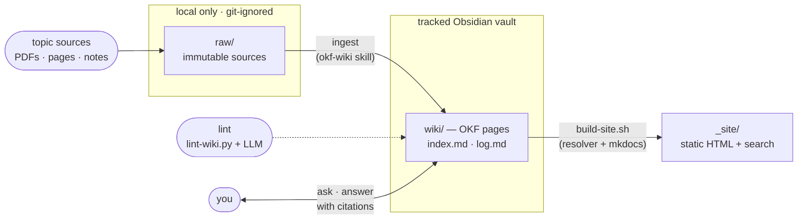

# OKF LLM Wiki + KG Starter

A generalizable, topic-agnostic starter for building a **personal LLM-powered knowledge
base** that is:

- authored as an **Obsidian vault** (write in `[[wikilinks]]`, live graph, backlinks),
- maintained by an LLM using the **Karpathy LLM-wiki pattern** (`raw/` → `wiki/`; ingest / query / lint),
- conformant to the **[Open Knowledge Format (OKF) v0.2](https://github.com/GoogleCloudPlatform/knowledge-catalog/blob/main/okf/SPEC.md)**
  so the knowledge is portable, agent-readable, and **trustable** — every page records where
  it came from (`sources`), who wrote it and when (`generated`), who confirmed it
  (`verified`), and where it sits in its lifecycle (`status`, `stale_after`) — and
- publishable as a **static, searchable website** via
  [`wiki-hosting-project`](https://github.com/biomystery/wiki-hosting-project).

This repo is a **clean template** — no domain content. Clone it, drop your sources into
`raw/`, and let the workflow compound your knowledge over time.

## The workflow at a glance



See **[WORKFLOW.md](WORKFLOW.md)** for the full step-by-step. The LLM's operating rules
live in **[CLAUDE.md](CLAUDE.md)** (the "schema layer"). How this maps onto OKF is in
**[OKF.md](OKF.md)**.

## Layout

| Path | Tracked? | Purpose |
|---|---|---|
| `raw/` | ❌ git-ignored | Immutable source material (PDFs, pasted text, exports). Read, never modify. |
| `wiki/` | ✅ | LLM-maintained OKF knowledge pages. Type-based subdirs + `index.md` + `log.md`. |
| `templates/` | ✅ | OKF-adapted frontmatter templates — also the vault's schema registry. |
| `scripts/` | ✅ | `new-vault.sh` (stamp out a vault) + `build-site.sh` (render static site) + `lint-wiki.py` (deterministic checks). |
| `.claude/skills/okf-wiki/` | ✅ | The vault's bundled ingest/query/lint skill for Claude Code. |
| `.obsidian/` | ✅ | Minimal, clean vault config (no community plugins bundled). |
| `CLAUDE.md`, `WORKFLOW.md`, `OKF.md` | ✅ | Schema layer + docs. |

> **Why `raw/` is ignored:** raw material is often large, copyrighted, or private. Keep it
> local (or on shared storage) and let the `wiki/` — your distilled, shareable knowledge —
> be the version-controlled artifact. Adjust `.gitignore` if your raw material is public.

## Quickstart

1. **Create a vault from this template** — `./scripts/new-vault.sh ~/projects/<name>-wiki "<Name> Wiki"`
   copies the tracked files, strips the example pages, resets `index.md`/`log.md`, records
   the starter commit in `.starter-version`, and `git init`s. Then open the folder as a vault
   in [Obsidian](https://obsidian.md).
2. **Add a source:** drop a file into `raw/<topic>/`, or paste text and ask your LLM to ingest.
3. **Ingest** (in Claude Code — the vault bundles its own `okf-wiki` project skill under
   `.claude/skills/`, so no install is needed):
   > "Add this to the wiki" / "Ingest raw/papers/foo.pdf"

   The LLM creates/updates OKF pages under `wiki/`, wires `[[wikilinks]]`, and logs it.
4. **Query:** "What do I know about X?" — the LLM reads `wiki/index.md` and answers with citations.
5. **Lint** periodically: "Lint the wiki" — or run the deterministic pass yourself:
   ```sh
   python3 scripts/lint-wiki.py      # frontmatter + OKF v0.2 trust fields, broken wikilinks,
                                     # index/log structure, provenance paths, orphans
   ```
6. **Publish** to a static site:
   ```sh
   ./scripts/build-site.sh ./ ./_site        # renders wiki/ → ./_site
   ```

## Day-to-day use: three loops

**1 · Author / ingest (Obsidian is the reading & capture surface).** Drop sources into
`raw/<topic>/`; images/PDFs pasted into notes land in `raw/attachments/` (git-ignored)
automatically. The graph, search, and link autocomplete show **only `wiki/`** — `raw/`,
`templates/`, `scripts/`, and build output are excluded via Obsidian's "Excluded files", so
the graph *is* the knowledge graph. Bookmarks (star icon) pin `wiki/index.md` and
`wiki/log.md` as entry points.

**2 · Ask (the agent runs beside the vault).** In a terminal at the vault root:

```sh
claude                      # then: "What do I know about <topic>?"
```

The bundled `okf-wiki` skill makes any Claude Code session vault-aware: it reads
`wiki/index.md`, synthesizes with citations, and only writes when you ask it to ingest or
archive. To ask *from inside Obsidian*, install a terminal-style plugin per-user (e.g.
**Shell commands** or **Terminal**) and bind a command that launches `claude` at the vault
root — deliberately not bundled (see plugin policy in [CLAUDE.md](CLAUDE.md)). With the
Obsidian CLI installed, the agent can also drive the app directly (open the answer page,
search, screenshot the graph).

**3 · Publish (optional).** `./scripts/build-site.sh` renders `wiki/` → `_site/` static
HTML with resolved links and client-side search; preview with
`python3 -m http.server -d _site 8090`. The site is a disposable build artifact — only
`wiki/` is the source of truth.

## What OKF v0.2 buys you

A corpus written mostly by an agent needs to answer four questions from frontmatter alone,
and v0.2 makes each one a field the linter checks (missing families are warnings, malformed
ones are errors — OKF never lets a consumer reject a bundle over an absent field):

| Question | Field | Where it comes from |
|---|---|---|
| What was this made from? | `sources: [{ id, resource, title, … }]` | the ingest step, pointing into `raw/` |
| Who wrote it, and when did it last change? | `generated: { by, at }` | the agent (`claude-code/opus-5`) or you (`human:<id>`) |
| Has anyone checked it? | `verified: [{ by, at }]` | **only you or an automated process** — never the agent that wrote the page |
| Is it current? | `status`, `stale_after` | `draft`/`stable`/`deprecated`, plus an optional expiry instant |

Per-claim attribution uses footnotes keyed to a source's `id` (`…as reported.[^smith-2026]`),
so a reader can trace one sentence to one source. Trust tiers (unverified /
machine-confirmed / human-reviewed) are *derived* from `verified`, never stored;
`lint-wiki.py` prints the mix so you can see how much of the vault you have actually read.
Details and the v0.1 → v0.2 migration table are in **[OKF.md](OKF.md)**.

## Publishing

`scripts/build-site.sh` wraps
[`wiki-hosting-project`](https://github.com/biomystery/wiki-hosting-project), which resolves
Obsidian `[[wikilinks]]` and frontmatter `aliases:` into standard relative Markdown links
(OKF-conformant output), converts callouts, builds a client-side full-text search, and
auto-generates navigation from the type-based folders. See that repo's README for Docker
serving and cron auto-rebuild.

## License

Template scaffolding only; add your own license. Your `wiki/` content is yours.
