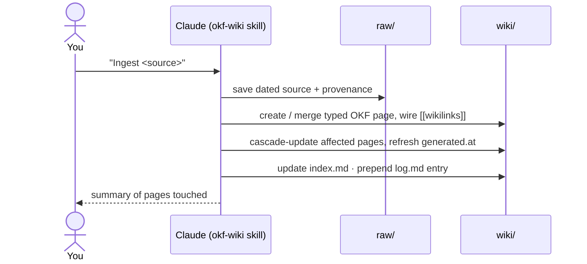

# Workflow

The end-to-end loop this repo generalizes. Domain-agnostic: works for research papers,
meeting notes, product docs, a codebase's design knowledge — any topic-based knowledge base.

## 1. Topic-based capture → `raw/`

Collect sources by topic. A "source" is anything: a paper PDF, a pasted article, a meeting
transcript, an exported thread. Save it under a topic subdirectory:

```
raw/<topic>/YYYY-MM-DD-descriptive-slug.md   (or .pdf, etc.)
```

`raw/` is **immutable** and **git-ignored**. It is the ground truth the wiki is distilled
from. Never hand-edit a raw file after capture; if a source changes, add a new dated file.

## 2. Ingest → `wiki/` (bundled `okf-wiki` skill)

Use the bundled [`okf-wiki`](.claude/skills/okf-wiki/SKILL.md) project skill (it ships with
the vault; [CLAUDE.md](CLAUDE.md) is the underlying schema layer).



The LLM:

- picks/creates the right **type-based** subdirectory (`concepts/`, `refs/`, `people/`, …),
- writes an **OKF page** — YAML frontmatter (required `type`, plus `title`, `description`,
  `tags`, and the v0.2 trust families `generated` / `sources` / `status`) + a distilled
  Markdown body,
- wires relationships with `[[wikilinks]]` (the knowledge **graph**),
- merges into an existing page when the source extends it, creates a new page for a new concept,
- records provenance in `sources:` and attributes individual claims with `[^source-id]`
  footnotes,
- flags contradictions with source attribution,
- updates `wiki/index.md` and prepends today's entry to `wiki/log.md` (newest first).

## 3. Compile → static HTML site

```sh
./scripts/build-site.sh ./ ./_site
```

This calls [`wiki-hosting-project`](https://github.com/biomystery/wiki-hosting-project),
which resolves `[[wikilinks]]`/aliases → relative Markdown links, converts Obsidian callouts
to admonitions, adds client-side full-text search, and builds navigation from the type
folders. Serve `./_site` from any web server, or use the project's Docker image behind your
own auth proxy. The content is private — never expose it directly.

## 4. Output: a lean Obsidian vault

The tracked artifact is a clean vault containing essentially **`wiki/` (the rendered
knowledge) plus the workflow docs** — `raw/` stays local. In Obsidian you get the live graph,
backlinks, and search over your `wiki/` while you author.

## 5. OKF conformance

Pages follow [OKF v0.2](OKF.md): concept-per-file, file path = identity, YAML frontmatter with
at least `type`, Markdown links for cross-references (the resolver emits these from your
`[[wikilinks]]`), and the reserved `index.md` / `log.md` in their §8 / §9 shapes. On top of
that, v0.2's trust families travel with every page — `sources` (what it was distilled from),
`generated` (who wrote it, when), `verified` (who confirmed it), `status` / `stale_after`
(where it sits in its lifecycle) — so a consumer can judge the knowledge, not just read it.
`wiki/index.md` declares the target version with `okf_version: "0.2"`.

**Verification is yours.** The agent writes `generated`; only you (`human:<id>`) or an
automated check (`process:<id>`) writes `verified`. That separation is what makes the derived
trust tiers mean anything — see [OKF.md](OKF.md) for the tiers and the v0.1 → v0.2 migration
table.

## 6. Output: a clean vault + wiki + reusable workflow

The deliverable is three things, all reusable:
1. a **clean Obsidian vault** (minimal config, no cruft),
2. a **`wiki/`** of OKF-conformant, cross-linked knowledge pages, and
3. **this workflow** (docs + skill + build script) you can re-apply to any new topic.

## 7. Hygiene: plugins & sensitive data

- **Minimal plugins.** This template bundles **no community plugins** (see `.obsidian/`).
  Add only what you need; recommended optional set is documented in [CLAUDE.md](CLAUDE.md).
- **No sensitive data in prompts or committed files.** Keep private/patient-identifiable or
  copyrighted material in `raw/` (git-ignored) and out of LLM chats. Run the sensitive-data
  checklist in [CLAUDE.md](CLAUDE.md) before sharing or publishing.
